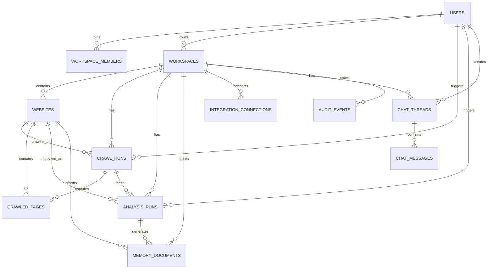
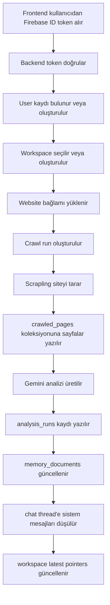

# Acrtech AI Marketer - Geliştirme Fazları ve Hedef Mimari

Tarih: 2026-04-02
Durum: Aktif yol haritası
Güncelleme Notu: Fazlar ilerledikçe bu dosya güncellenecek, tamamlanan maddeler işaretlenecek ve kararlar revize edilecektir.

## 1. Hedef

Amaç, mevcut prototipi temiz ayrışmış, güvenli, izlenebilir ve ölçeklenebilir bir ürün mimarisine taşımaktır.

Bu mimarinin temel ilkeleri:

- auth ve application data ayrımı net olacak
- crawl, analiz, hafıza ve sohbet katmanları birbirinden ayrılacak
- her koleksiyonun tek bir temel sorumluluğu olacak
- büyük veri blob'ları "son snapshot" içine gömülmeyecek
- backend kullanıcıyı Firebase token ile doğrulayacak
- sistem gelecekte çoklu workspace ve ekipli kullanıma hazır olacak

## 2. GraphQL Gerekir mi?

Kısa cevap: Şu an hayır.

Neden:

- ürün şu an ağırlıklı olarak command/workflow tabanlı
- ana kullanım "analiz başlat", "workspace getir", "hafıza dosyası listele", "sohbet mesajı ekle" gibi net aksiyonlardan oluşuyor
- REST bu aşamada daha basit, daha anlaşılır ve daha az operasyonel yük getirir

GraphQL ne zaman düşünülebilir:

- çok sayıda dashboard widget'ı aynı anda farklı alt verileri isterse
- mobil uygulama + admin panel + web istemcisi aynı veriyi farklı granülerlikte sorgulamaya başlarsa
- veri okuma tarafında ciddi overfetch / underfetch problemi oluşursa

Öneri:

- yazma işlemleri REST kalsın
- okuma tarafı da önce temiz resource bazlı REST ile büyüsün
- gerekiyorsa Phase 6 sonrası sadece read layer için GraphQL veya BFF düşünelim

## 3. Hedef Veri Mimarisi

## Temel Koleksiyonlar

### `users`

Amaç:

- Firebase kullanıcısının uygulama içi profili

Alanlar:

- `_id`
- `firebaseUid`
- `emailNormalized`
- `displayName`
- `photoUrl`
- `providers`
- `defaultWorkspaceId`
- `createdAt`
- `updatedAt`
- `lastLoginAt`

Index:

- unique `firebaseUid`
- unique sparse `emailNormalized`

### `workspaces`

Amaç:

- markaya veya müşteriye ait ana çalışma alanı

Alanlar:

- `_id`
- `ownerUserId`
- `name`
- `slug`
- `status`
- `selectedSpecialist`
- `trial`
- `currentWebsiteId`
- `latestCrawlRunId`
- `latestAnalysisRunId`
- `latestThreadId`
- `createdAt`
- `updatedAt`

Index:

- `ownerUserId`
- unique `slug`

### `workspace_members`

Amaç:

- ekipli kullanım ve rol yönetimi

Alanlar:

- `_id`
- `workspaceId`
- `userId`
- `role`
- `status`
- `createdAt`
- `updatedAt`

Index:

- unique compound `workspaceId + userId`

### `websites`

Amaç:

- analiz edilen domain ve marka kimliği

Alanlar:

- `_id`
- `workspaceId`
- `inputUrl`
- `canonicalUrl`
- `domain`
- `brandName`
- `logoUrl`
- `language`
- `currencies`
- `contactSignals`
- `siteSignals`
- `createdAt`
- `updatedAt`

Index:

- `workspaceId`
- `domain`
- compound `workspaceId + domain`

### `crawl_runs`

Amaç:

- her crawl denemesinin ayrı kaydı

Alanlar:

- `_id`
- `workspaceId`
- `websiteId`
- `triggeredByUserId`
- `status`
- `fetchStrategy`
- `pageLimit`
- `depthLimit`
- `pagesVisited`
- `pagesSucceeded`
- `pagesFailed`
- `notes`
- `startedAt`
- `finishedAt`
- `createdAt`

Index:

- `workspaceId + createdAt desc`
- `websiteId + createdAt desc`
- `status`

### `crawled_pages`

Amaç:

- crawl sırasında toplanan sayfa bazlı içerik ve sinyaller

Alanlar:

- `_id`
- `crawlRunId`
- `websiteId`
- `url`
- `normalizedUrl`
- `pageType`
- `fetchMode`
- `statusCode`
- `title`
- `description`
- `headings`
- `excerpt`
- `mainContent`
- `ctaTexts`
- `valueProps`
- `pricingSignals`
- `faqItems`
- `forms`
- `structuredData`
- `imageAlts`
- `logoCandidates`
- `technologies`
- `meta`
- `createdAt`

Index:

- `crawlRunId`
- `websiteId + normalizedUrl`
- text veya arama amaçlı ek indexler daha sonra

### `analysis_runs`

Amaç:

- Gemini veya fallback ile oluşan yorumlanmış analiz çıktısı

Alanlar:

- `_id`
- `workspaceId`
- `websiteId`
- `crawlRunId`
- `triggeredByUserId`
- `engine`
- `engineVersion`
- `promptVersion`
- `analysisFingerprint`
- `analysis`
- `summary`
- `notes`
- `createdAt`

Index:

- `workspaceId + createdAt desc`
- `crawlRunId`
- `analysisFingerprint`

### `memory_documents`

Amaç:

- işletme profili, marka kılavuzu, pazar araştırması, strateji gibi kalıcı hafıza belgeleri

Alanlar:

- `_id`
- `workspaceId`
- `websiteId`
- `analysisRunId`
- `kind`
- `filename`
- `title`
- `blurb`
- `markdown`
- `version`
- `isCurrent`
- `createdAt`
- `updatedAt`

Index:

- `workspaceId + kind + isCurrent`
- `analysisRunId`

### `integration_connections`

Amaç:

- üçüncü parti platform bağlantıları

Alanlar:

- `_id`
- `workspaceId`
- `provider`
- `status`
- `accountLabel`
- `scopes`
- `tokenRef`
- `lastSyncAt`
- `createdAt`
- `updatedAt`

Not:

- hassas tokenlar düz metin saklanmamalı
- tercihen şifrelenmiş ya da external secret store mantığına bağlanmalı

### `chat_threads`

Amaç:

- workspace içindeki sohbet oturumları

Alanlar:

- `_id`
- `workspaceId`
- `title`
- `status`
- `createdByUserId`
- `createdAt`
- `updatedAt`

### `chat_messages`

Amaç:

- kullanıcı ve Aylin mesaj geçmişi

Alanlar:

- `_id`
- `threadId`
- `workspaceId`
- `senderType`
- `senderId`
- `messageType`
- `content`
- `attachments`
- `relatedAnalysisRunId`
- `relatedMemoryDocumentIds`
- `createdAt`

Index:

- `threadId + createdAt`
- `workspaceId + createdAt`

### `audit_events`

Amaç:

- kritik olay takibi

Alanlar:

- `_id`
- `workspaceId`
- `userId`
- `eventType`
- `entityType`
- `entityId`
- `payload`
- `createdAt`

## 4. Hedef Veri İlişkileri

## 5. Hedef Sistem Akışı

## 6. Fazlar

## Phase 0 - Dokümantasyon ve Mimari Karar Kilidi

Amaç:

- bugünkü sistemin teknik fotoğrafını yazılı hale getirmek
- hedef veri mimarisini netleştirmek
- fazları kilitlemek

Teslimler:

- [2026-04-02-proje-analizi.md](C:/Users/acero/Documents/GitHub/ai-marketer/development-files/2026-04-02-proje-analizi.md)
- bu faz dokümanı

Durum:

- [x] tamamlandı

## Phase 1 - Kimlik ve Güvenlik Katmanı

Amaç:

- backend'de Firebase token doğrulamasını aktif etmek
- kullanıcı kimliğini backend'in tek doğruluk kaynağı yapmak

İşler:

- Firebase ID token doğrulama katmanı
- frontend isteklerine `Authorization: Bearer <idToken>` eklenmesi
- backend'de auth middleware / dependency kurulması
- `userId` ve `email` alanlarının request body'den güvenilir kaynak olmaktan çıkarılması
- user provisioning akışı

Teslimler:

- güvenli auth zinciri
- `users` koleksiyonu
- backend auth helper katmanı

Durum:

- [x] tamamlandı

Tamamlananlar:

- frontend API istekleri artık Firebase ID token ile gidiyor
- backend `Authorization: Bearer` başlığından token doğruluyor
- backend doğrulanmış kullanıcıyı `users` koleksiyonuna upsert ediyor
- `workspace-snapshot` endpoint'leri artık istemciden gelen kullanıcı kimliğine güvenmiyor
- `analyze` endpoint'i de artık doğrulanmış oturum gerektiriyor

## Phase 2 - Workspace ve Website Ayrıştırması

Amaç:

- mevcut snapshot mantığını gerçek workspace modeline dönüştürmek

İşler:

- `workspaces` koleksiyonu
- `websites` koleksiyonu
- `workspace_members` koleksiyonu
- mevcut snapshot verisinin migration stratejisi
- workspace current pointers yaklaşımı

Teslimler:

- kullanıcı -> workspace -> website ilişkisi
- son aktif analiz yerine gerçek çalışma alanı modeli

Durum:

- [x] tamamlandı

Tamamlananlar:

- `workspaces` koleksiyonu eklendi
- `workspace_members` koleksiyonu eklendi
- `websites` koleksiyonu eklendi
- `analysis_runs` kayıtları artık `workspaceId` ve `websiteId` ilişkileriyle yazılıyor
- kullanıcıların `defaultWorkspaceId` alanı aktif workspace pointer'ı olarak kullanılmaya başlandı
- mevcut `workspace-snapshot` endpoint'leri yeni veri modelinin üstüne compatibility layer olarak oturtuldu
- eski `workspace_snapshots` verisi için geriye dönük migration fallback'i eklendi

## Phase 3 - Scrapling Veri Toplama Katmanını Derinleştirme

Amaç:

- crawl verisini tekrar kullanılabilir bir araştırma katmanına dönüştürmek

İşler:

- `crawl_runs` koleksiyonu
- `crawled_pages` koleksiyonu
- crawl status ve error alanları
- sayfa tipi sınıflandırmasının geliştirilmesi
- sitemap, priority pages, render escalation ve crawl notes standardizasyonu
- gerekirse Scrapling spider/checkpoint kullanımına geçiş

Teslimler:

- yeniden kullanılabilir crawl geçmişi
- sayfa bazlı veri seti
- daha kaliteli araştırma paketi

Tamamlananlar:

- `crawl_runs` ve `crawled_pages` koleksiyonları aktif hale getirildi
- `/api/analyze` çıktısına `crawlMeta` ve detaylı `crawlPages` alanları eklendi
- workspace kaydı sırasında crawl verisi ayrı koleksiyonlara yazılıyor
- workspace geri yükleme sırasında crawl verisi `analysisResult` ile yeniden birleştiriliyor
- Scrapling notları `INFO/WARN/ERROR` formatında standardize ediliyor
- workspace ve website pointer'larına `latestCrawlRunId` / `lastCrawlRunId` alanları eklendi

Durum:

- [x] tamamlandı

## Phase 4 - Analiz ve Hafıza Katmanı

Amaç:

- analiz çıktılarını snapshot içinden çıkarıp bağımsız versiyonlu içeriklere dönüştürmek

İşler:

- `analysis_runs` koleksiyonunun yeni modele göre genişletilmesi
- `memory_documents` koleksiyonunun eklenmesi
- prompt versioning
- analysis fingerprinting ve dedupe mantığı
- memory file current version yönetimi

Teslimler:

- analiz tarihi
- hafıza doküman versiyonları
- önceki analizlerle kıyas yapabilme zemini

Tamamlananlar:

- `memory_documents` koleksiyonu aktif hale getirildi
- `analysis_runs` içine `engine`, `engineVersion`, `promptVersion`, `duplicateOfAnalysisRunId` ve `memoryDocumentIds` alanları eklendi
- workspace kaydı sırasında `.md` hafıza dosyaları ayrı koleksiyona taşınıyor
- mevcut current dokümanla aynı içerik gelirse yeni versiyon açmak yerine mevcut hafıza dokümanı yeniden kullanılıyor
- içerik değiştiğinde eski current sürüm kapatılıp yeni versiyon current olarak işaretleniyor
- workspace geri yükleme sırasında `memory_documents` tekrar `analysisResult.memoryFiles` içine birleştiriliyor
- frontend tarafında restore edilen snapshot'ın tekrar tekrar DB'ye yazılması engellendi

Durum:

- [x] tamamlandı

## Phase 5 - Sohbet ve Çalışma Alanı Operasyonları

Amaç:

- workspace ekranını gerçek thread/message modeliyle beslemek

İşler:

- `chat_threads`
- `chat_messages`
- sistem event mesajları
- hafıza kartı mesajları
- analiz tamamlandı / dosya kaydedildi / fırsat bulundu gibi timeline event'leri

Teslimler:

- gerçek sohbet geçmişi
- daha güçlü UX
- Helena benzeri akışın veri tabanı karşılığı

Tamamlananlar:

- `chat_threads` ve `chat_messages` koleksiyonları aktif hale getirildi
- analiz sonucundan üretilen timeline event'leri DB'ye sistem mesajları olarak yazılıyor
- hafıza kartları thread içinde attachment tabanlı mesajlar olarak temsil ediliyor
- workspace restore akışı artık gerçek thread/message verisiyle besleniyor
- `/api/analyze` yanıtı da aynı message modelini taşıyan geçici `chatThread` döndürüyor
- frontend chat paneli hardcoded bloklar yerine gerçek messageType tabanlı render mantığına geçti
- restore edilen snapshot'ın tekrar write edilmesi engellenerek gereksiz duplicate analysis/chat üretimi azaltıldı

Durum:

- [x] tamamlandı

## Phase 6 - Entegrasyon Katmanı

Amaç:

- harici platform bağlantılarını güvenli ve izlenebilir hale getirmek

İşler:

- `integration_connections`
- `integration_sync_runs`
- token güvenliği
- bağlantı durumu ve hata mesajları

Teslimler:

- platform bazlı bağlantı kayıtları
- senkron geçmişi

Durum:

- [x] tamamlandı

Tamamlananlar:

- `integration_connections` ve `integration_sync_runs` koleksiyonları aktif hale getirildi
- onboarding sırasında seçilen platformlar provider bazlı normalize edilerek workspace'e bağlanıyor
- gerçek OAuth henüz yokken bağlantılar `pending` / `selection_only` mantığıyla izleniyor
- her yeni seçim veya kaldırma aksiyonu için izlenebilir `integration_sync_runs` kayıtları oluşuyor
- workspace restore akışı entegrasyon durumunu ve son sync özetlerini `analysisResult` içine tekrar birleştiriyor
- `/api/analyze` yanıtı da seçilen platformlar için preview `integrationConnections` ve `integrationSyncRuns` döndürüyor

## Phase 7 - Gözlemlenebilirlik ve Operasyon

Amaç:

- sistemin davranışını ölçülebilir hale getirmek

İşler:

- `audit_events`
- backend structured logging
- crawl başarısı / analiz başarısı / response süreleri
- basit admin debug ekranı ya da log konsolidasyonu

Teslimler:

- operasyonel görünürlük
- hata ayıklama kolaylığı

Durum:

- [x] tamamlandı

Tamamlananlar:

- `audit_events` koleksiyonu ve indexleri eklendi
- backend için JSON structured logging katmanı kuruldu
- tüm HTTP isteklerine `requestId` ve süre ölçümü eklendi
- `/api/analyze` akışı crawl, sentez ve toplam süreleri loglayıp audit event yazıyor
- `/api/workspace-snapshot` read/write akışları artık audit event ve structured log üretiyor
- son operasyon kayıtlarını okumak için `/api/ops/recent-events` endpoint'i eklendi

## 7. API Tasarım Yönü

Bugünkü öneri:

- REST ile devam

Hedef resource örnekleri:

- `GET /api/me`
- `GET /api/workspaces`
- `POST /api/workspaces`
- `GET /api/workspaces/:id`
- `POST /api/workspaces/:id/analyze`
- `GET /api/workspaces/:id/analysis-runs`
- `GET /api/workspaces/:id/memory-documents`
- `GET /api/workspaces/:id/chat-threads`
- `POST /api/chat-threads/:id/messages`
- `GET /api/workspaces/:id/integrations`

## 8. Migration Stratejisi

Önerilen geçiş sırası:

1. auth doğrulamasını düzelt
2. `users` ve `workspaces` koleksiyonlarını ekle
3. mevcut snapshot modelini pointer modeline çevir
4. crawl ve analysis verisini ayrıştır
5. memory documents katmanını ekle
6. chat modelini bağımsızlaştır

Bu sırayla ilerlemek riskleri azaltır çünkü önce güvenlik ve kimlik çözülür, sonra veri modeli parçalanır.

## 9. Riskler

- tek seferde çok büyük migration yapılırsa frontend kırılabilir
- Firebase token doğrulaması geç eklenirse güvenlik açığı devam eder
- crawl verisi doğrudan analysis blob'u içinde kalırsa Mongo belgeleri şişer
- memory ve chat aynı dökümanlara gömülürse ileride okunabilirlik bozulur

## 10. Faz Güncelleme Alanı

Bu bölüm ileride düzenli olarak güncellenecek.

### 2026-04-02

- [x] hedef veri modelinin ilk taslağı yazıldı
- [x] koleksiyon ayrıştırma planı yazıldı
- [x] GraphQL kararı ilk aşama için "hayır" olarak netleştirildi
- [x] Phase 1 tamamlandı: Firebase token doğrulaması ve `users` koleksiyonu eklendi
- [x] Phase 2 tamamlandı: `workspaces`, `workspace_members` ve `websites` koleksiyonları aktif hale getirildi
- [x] Phase 3 tamamlandı: `crawl_runs` ve `crawled_pages` koleksiyonları, `crawlMeta` roundtrip'i ve crawl geri yükleme katmanı eklendi
- [x] Phase 4 tamamlandı: `memory_documents` koleksiyonu, analiz meta alanları ve hafıza versioning/reuse mantığı eklendi
- [x] Phase 5 tamamlandı: `chat_threads`, `chat_messages` ve gerçek timeline tabanlı workspace sohbet akışı eklendi
- [x] Phase 6 tamamlandı: `integration_connections`, `integration_sync_runs` ve provider bazlı bağlantı durumu katmanı eklendi
- [x] Phase 7 tamamlandı: `audit_events`, structured logging ve operasyon debug endpoint'i eklendi
