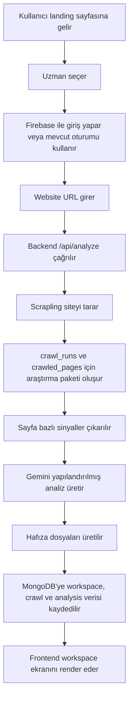
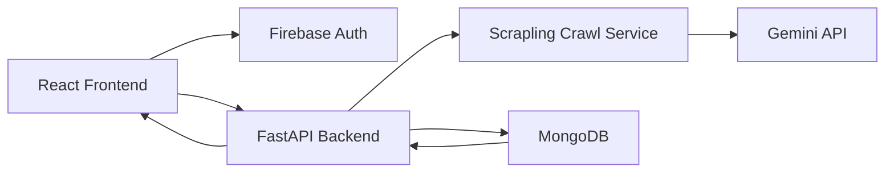

# Acrtech AI Marketer - Proje Analizi

Tarih: 2026-04-02
Durum: Aktif analiz dokümanı
Güncelleme Notu: Bu dosya mevcut sistemin teknik fotoğrafını anlatır. Mimari değiştikçe aynı dosya güncellenecektir.

## 1. Projenin Amacı

Acrtech AI Marketer, yerel e-ticaret markalarına ve küçük işletmelere "otonom dijital pazarlama çalışma alanı" sunmayı hedefler. Kullanıcı klasik bir SaaS paneli yönetmek yerine, Aylin adlı yapay zeka pazarlama uzmanıyla sohbet ederek işletmesini analiz ettirir, strateji üretir ve ileride kampanya/entegrasyon süreçlerini yönetir.

Ana ürün hissi:

- kullanıcı web sitesini verir
- sistem siteyi tarar
- marka ve teklif yapısını çözer
- pazarlama stratejisi üretir
- hafıza dosyaları oluşturur
- kullanıcıyı sohbet tabanlı bir çalışma alanına alır

Bu yüzden ürünün çekirdeği bir dashboard değil, "analiz + hafıza + sohbet" birleşimidir.

## 2. Bugün Neleri Kullanıyoruz

## Frontend

- React 19
- TypeScript
- Vite
- Firebase Web SDK

Ana sorumluluklar:

- landing ve onboarding akışı
- Firebase ile Google ve e-posta/şifre girişi
- analiz başlatma
- workspace ekranını gösterme
- mevcut workspace snapshot'ını geri yükleme

Önemli dosyalar:

- [App.tsx](C:/Users/acero/Documents/GitHub/ai-marketer/src/App.tsx)
- [api.ts](C:/Users/acero/Documents/GitHub/ai-marketer/src/lib/api.ts)
- [firebase.ts](C:/Users/acero/Documents/GitHub/ai-marketer/src/lib/firebase.ts)
- [types.ts](C:/Users/acero/Documents/GitHub/ai-marketer/src/types.ts)

## Backend

- FastAPI
- Pydantic
- Gemini API entegrasyonu
- Scrapling tabanlı crawl servisi
- MongoDB veri katmanı

Ana sorumluluklar:

- scrape ve içerik çıkarımı
- Gemini ile stratejik analiz üretimi
- fallback analiz üretimi
- workspace state'ini veritabanında saklama
- frontend için sağlık ve veri endpoint'leri sağlama

Önemli dosyalar:

- [main.py](C:/Users/acero/Documents/GitHub/ai-marketer/backend/app/main.py)
- [scrape.py](C:/Users/acero/Documents/GitHub/ai-marketer/backend/app/services/scrape.py)
- [gemini.py](C:/Users/acero/Documents/GitHub/ai-marketer/backend/app/services/gemini.py)
- [fallback.py](C:/Users/acero/Documents/GitHub/ai-marketer/backend/app/services/fallback.py)
- [workspace_store.py](C:/Users/acero/Documents/GitHub/ai-marketer/backend/app/services/workspace_store.py)

## Kimlik Doğrulama

- Firebase Auth
- Google Sign-In
- Email / Password Sign-In

Bugünkü durum:

- frontend kullanıcı girişini Firebase ile yapıyor
- frontend backend isteklerine Firebase ID token gönderiyor
- backend Firebase ID token doğrulaması yapıyor
- backend doğrulanmış kullanıcıyı MongoDB içindeki `users` koleksiyonuna upsert ediyor
- kullanıcı bilgisi artık backend için istemciden gelen `userId/email` alanlarından değil, doğrulanmış token claim'lerinden okunuyor

Bu katman artık Phase 1 kapsamında aktif hale getirildi.

## Scraping Katmanı

Kaynak proje:

- [Scrapling-main](C:/Users/acero/Documents/GitHub/ai-marketer/Scrapling-main)

Kullanılan yaklaşım:

- önce URL normalize edilir
- site crawl edilir
- mümkünse Scrapling fetcher katmanı kullanılır
- static -> dynamic -> stealth yükseltmesi uygulanır
- sayfa bazlı sinyaller çıkarılır
- logo, CTA, heading, pricing, FAQ, structured data, iletişim sinyalleri, teknoloji sinyalleri toplanır

Bugünkü `scrape.py` içindeki temel katmanlar:

- `FetcherSession`
- `AsyncDynamicSession`
- `AsyncStealthySession`
- `Selector`
- `Convertor`

Toplanan başlıca veri tipleri:

- URL ve canonical/domain bilgisi
- title / meta description
- heading yapısı
- ana içerik özeti
- CTA metinleri
- value proposition sinyalleri
- fiyat sinyalleri
- FAQ verileri
- form yapıları
- structured data
- entity ve kategori ipuçları
- görsel alt metinleri
- logo adayları
- teknoloji imzaları
- iletişim sinyalleri

## AI Analiz Katmanı

Gemini burada ham HTML okumaz. Önce Scrapling ile veri sıkıştırılır, sonra Gemini bu araştırma paketini yorumlar.

Gemini'nin rolü:

- işletmenin ne sattığını anlamak
- teklif yapısını özetlemek
- hedef kitleyi yorumlamak
- fiyat ve konumlandırma çıkarımı yapmak
- büyüme fırsatı önermek
- `.md` hafıza dosyaları üretmek

Oluşan ana hafıza dosyaları:

- işletme profili
- marka kılavuzu
- pazar araştırması
- strateji

Bugünkü ek durum:

- analiz sonucu artık `analysisMeta` ile hangi motorun ve prompt versiyonunun kullanıldığını taşıyor
- `analysis_runs` kaydı içinde `engine`, `engineVersion`, `promptVersion` ve `analysisFingerprint` tutuluyor
- hafıza dosyaları ana analiz blob'undan ayrılarak versiyonlu `memory_documents` koleksiyonuna yazılıyor

Bu yaklaşımın temel ilkesi:

- Scrapling = kanıt toplar
- Gemini = yorumlar
- fallback servis = Gemini yoksa minimum güvenli çıktı üretir

## Veri Katmanı

Bugün artık dosya tabanlı store yerine MongoDB kullanıyoruz.

Aktif koleksiyonlar:

- `users`
- `workspaces`
- `workspace_members`
- `websites`
- `crawl_runs`
- `crawled_pages`
- `analysis_runs`
- `memory_documents`
- `integration_connections`
- `integration_sync_runs`
- `audit_events`
- `chat_threads`
- `chat_messages`

Bugünkü yaklaşım:

- doğrulanmış Firebase kullanıcıları `users` koleksiyonunda tutuluyor
- bir kullanıcının aktif çalışma alanı `workspaces` koleksiyonunda tutuluyor
- workspace ile kullanıcı ilişkisi `workspace_members` ile temsil ediliyor
- analiz edilen website bağlamı `websites` koleksiyonunda tutuluyor
- Scrapling ile yapılan her tarama `crawl_runs` koleksiyonuna ayrı bir çalışma olarak yazılıyor
- sayfa bazlı kanıt paketi `crawled_pages` içine kaydediliyor
- geçmiş analiz kayıtları `analysis_runs` içine yazılıyor
- `.md` hafıza belgeleri `memory_documents` koleksiyonunda current/version mantığıyla tutuluyor
- seçilen ve bağlanan platformlar `integration_connections` koleksiyonunda provider bazlı tutuluyor
- entegrasyon denemeleri ve atlanan sync kayıtları `integration_sync_runs` içinde izleniyor
- analiz, snapshot ve request seviyesindeki operasyon kayıtları `audit_events` koleksiyonunda tutuluyor
- workspace zaman çizgisi `chat_threads` ve `chat_messages` koleksiyonlarında tutuluyor
- eski `workspace_snapshots` koleksiyonu yalnızca geriye dönük migration fallback'i olarak ele alınıyor

Bu geçişle kullanıcı -> workspace -> website -> crawl -> analysis -> memory -> integrations -> chat zinciri kurulmuş oldu.

## Gözlemlenebilirlik Katmanı

Faz 7 ile birlikte backend artık sadece veri üretmiyor, kendi davranışını da kaydediyor.

Eklenen parçalar:

- `audit_events` koleksiyonu
- JSON structured logging helper'ı
- request bazlı `requestId` üretimi
- `analyze` ve `workspace-snapshot` akışlarında süre ölçümü
- son operasyonları okumak için `/api/ops/recent-events`

Bugünkü yaklaşım:

- her HTTP isteği path, status code ve duration ile loglanıyor
- analiz akışı crawl süresi, sentez süresi ve toplam süre ile loglanıyor
- workspace restore ve persist operasyonları hem log hem audit event olarak yazılıyor
- kullanıcı isterse son operasyonları Mongo'ya doğrudan girmeden API üzerinden okuyabiliyor

## Çalıştırma Ortamı

- Docker Compose
- MongoDB container
- FastAPI backend container
- Vite frontend container

Ana dosyalar:

- [docker-compose.yml](C:/Users/acero/Documents/GitHub/ai-marketer/docker-compose.yml)
- [backend/Dockerfile](C:/Users/acero/Documents/GitHub/ai-marketer/backend/Dockerfile)
- [frontend/Dockerfile](C:/Users/acero/Documents/GitHub/ai-marketer/frontend/Dockerfile)
- [calistir.bat](C:/Users/acero/Documents/GitHub/ai-marketer/calistir.bat)
- [db-sifirla.bat](C:/Users/acero/Documents/GitHub/ai-marketer/db-sifirla.bat)

## 3. Mevcut Sistem Akışı

## 4. Bugünkü Veri Akışı

## 5. Bugünkü Güçlü Yönler

- ürün deneyimi chat-first düşünülmüş durumda
- scraping katmanı basit HTML parse seviyesinin üstüne çıktı
- Gemini ham HTML yerine araştırma paketi üzerinden çalışıyor
- Docker ile yerel geliştirme standardize edildi
- MongoDB'ye geçiş yapıldı
- Firebase login akışı çalışıyor

## 6. Bugünkü Açıklar ve Teknik Borçlar

## Güvenlik

- backend artık Firebase ID token doğruluyor
- backend artık istemciden gelen kullanıcı kimliğine güvenmiyor
- bir sonraki güvenlik adımı rol/izin modeli ve workspace üyelik katmanını eklemek

## Veri Modeli

- `workspaces` artık daha temiz ama crawl verisi, analiz verisi, chat verisi ve brand hafızası hâlâ tam ayrışmış değil
- `analysis_runs` halen tam hafıza/version katmanına dönüşmedi

## Uygulama Mimarisi

- workspace ile analysis sonucu birbirine fazla bağlı
- gelecekte ekipli kullanım ve çoklu workspace desteği için veri katmanı dar kalabilir

## Scraping Stratejisi

- Scrapling güçlü kullanılıyor ama ileride spider/checkpoint/session routing tarafı daha derin kullanılmalı
- crawl geçmişi ayrı kayıtlanmalı
- sayfa snapshot'ları tekrar kullanılabilir hale getirilmeli

## Analiz Kalitesi

- rakip, kategori, SERP ve keyword katmanı henüz derinleşmedi
- hafıza dosyaları versiyonlanmış içerik nesnelerine dönüştürülmeli

## 7. Bugünkü Sistem Bileşenleri

### Frontend Bileşenleri

- onboarding akışı
- auth ekranı
- website giriş ekranı
- hedef seçimi
- platform bağlama adımı
- workspace/chat ekranı

### Backend Bileşenleri

- analyze endpoint
- workspace snapshot endpoint'leri
- scrape service
- gemini service
- fallback service
- mongo store service

### Veri Nesneleri

- kullanıcı kimliği
- workspace snapshot
- analysis result
- memory file
- source page
- contact signals

## 8. Scrapling'i Neden Merkeze Koyuyoruz

Bu projede analiz kalitesi doğrudan scrape kalitesine bağlıdır. Yani ürünün gerçek değeri yalnızca "LLM kullanıyor olmak" değildir. Esas değer:

- doğru sayfaları bulmak
- ana içeriği temiz çıkarmak
- teklif/fiyat/CTA gibi ticari sinyalleri yakalamak
- siteyi sadece metin olarak değil bir pazarlama sistemi olarak okuyabilmektir

Scrapling bu yüzden çekirdek araştırma motorudur. Gemini ise bu motorun topladığı kanıtlardan strateji çıkaran yorum katmanıdır.

## 9. Kısa Mimari Sonuç

Bugünkü yapı artık prototip seviyesini geçti. Ancak gerçek ürün mimarisi için bir sonraki adım:

- veri modelini daha çok ayırmak
- Firebase doğrulamasını backend'e taşımak
- crawl ve analysis kayıtlarını bağımsızlaştırmak
- brand memory ve chat katmanını ayrı ele almak

Bu geçiş tamamlandığında sistem hem güvenli hem ölçeklenebilir hem de yönetilebilir hale gelir.

## 10. Sonraki Referans Dokümanı

Bir sonraki ana doküman:

- [2026-04-02-gelistirme-fazlari.md](C:/Users/acero/Documents/GitHub/ai-marketer/development-files/2026-04-02-gelistirme-fazlari.md)
