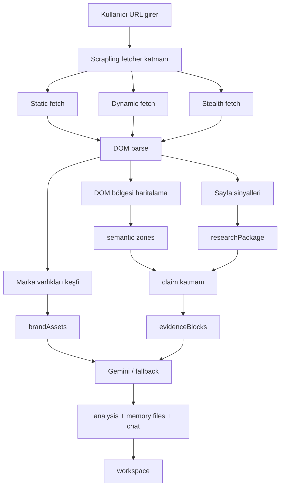

# Scrape Derinleştirme Planı

Oluşturulma zamanı: 2026-04-03 10:47
Son güncelleme: 2026-04-03 11:58

## Amaç

İlk analiz deneyimini gerçek bir araştırma ajanı seviyesine taşımak.

Ana hedefler:

- Girilen her site için güvenilir logo, icon, favicon ve ilgili marka varlıklarını bulmak
- “Bu site tam olarak ne yapıyor?” sorusuna yorum değil, kanıt tabanlı cevap vermek
- Değer önerilerini, faydaları, güven sinyallerini ve dönüşüm yolunu birbirine karıştırmadan ayırmak
- Scrapling-main projesinin yalnızca temel parser parçalarını değil, fetcher, adaptive ve spider katmanlarını da ürün seviyesinde kullanmak

## Sorun Özeti

Başlangıçta sistem güçlü bir temel sağlıyordu ama şu eksikler vardı:

1. Logo keşfi deterministik değildi.
2. Değer önerisi çıkarımı çok genişti.
3. DOM bölgesi ayrımı zayıftı.
4. Spider gücü kullanılmıyordu.
5. İngilizce sızıntıları son çıktıya karışıyordu.

## Fazlar

### Faz 1 - Marka Varlıkları Keşfi

Amaç:
Siteye ait marka görsellerini güvenilir biçimde bulmak ve workspace sol üstte kullanılacak ana logoyu seçmek.

Teslimatlar:

- `brandAssets` veri modeli
- `brandLogo`, `favicon`, `touchIcon`, `socialImage`, `manifestUrl`, `maskIcon`, `tileImage`
- `manifest.json` içinden icon çözümleme
- `mask-icon`, `msapplication-TileImage`, `shortcut icon`, `/favicon.ico` fallback
- header/nav/logo img ve inline svg adayları
- skorlayıcı ve aday listesi

Başarı kriteri:

- Sol üst logo alanı daha yüksek doğrulukla dolmalı
- Logo yoksa favicon fallback olmalı
- Sosyal paylaşım görseli yanlışlıkla logo seçilmemeli

Durum:
- `completed`

Uygulama notu:

- Backend ve frontend boyunca `brandAssets` taşınıyor
- Workspace artık önce `brandLogo`, sonra `favicon`, sonra `touchIcon`, sonra eski `logoUrl` fallback’i kullanıyor
- Canlı doğrulamada `https://olric.app` için ana logo ile favicon ayrı yakalandı

### Faz 2 - DOM Bölgesi Haritalama

Amaç:
Sayfadaki önemli blokları semantik olarak ayırmak.

Teslimatlar:

- `hero`
- `offers`
- `proof`
- `pricing`
- `faq`
- `contact`

Başarı kriteri:

- Hero, teklif, proof, pricing ve footer sinyalleri aynı havuzda karışmamalı

Durum:
- `completed`

Uygulama notu:

- `extract_semantic_zones` katmanı eklendi
- Sayfa bazlı `zones` alanı `PageSnapshot` içine yazılıyor
- `researchPackage.semanticZones` özet katmanı oluşturuluyor
- Doğrulamada `example.com` üzerinde `hero` bölgesi ve cümle parçaları ayrı üretildi

### Faz 3 - Kanıt Tabanlı Değer Önerisi Çıkarımı

Amaç:
Value proposition, supporting benefit, proof claim ve audience claim alanlarını ayırmak.

Teslimatlar:

- `coreValueProps`
- `supportingBenefits`
- `proofClaims`
- `audienceClaims`
- `ctaClaims`
- `evidenceBlocks`

Başarı kriteri:

- “Ne yapıyor?” sorusuna çıkan cümle kısa, net ve kanıta bağlı olmalı

Durum:
- `completed`

Uygulama notu:

- Claim adayları için puanlayıcı katman eklendi
- `evidenceBlocks` URL bazlı dayanak taşıyor
- `positioning_signals` artık daha çok `coreValueProps` ve semantik bölgelerden besleniyor
- Doğrulamada `example.com` için `coreValueProps` ve `evidenceBlocks` üretildi

### Faz 4 - Scrapling Spider Migrasyonu

Amaç:
Manuel queue yapısından Scrapling Spider yapısına geçmek.

Teslimatlar:

- multi-session spider
- fast / dynamic / stealth routing
- blocked detection
- checkpoint / resume
- kontrollü spider entegrasyonu

Başarı kriteri:

- Crawl yönetimi daha temiz ve ölçeklenebilir olmalı

Durum:
- `completed`

Uygulama notu:

- `WebsiteAnalysisSpider` eklendi
- `SCRAPLING_ENABLE_SPIDER=true` iken spider yolu aktif oluyor
- Varsayılan çalışma yolu güvenli fetcher escalation olarak bırakıldı
- Spider başarısız olursa sistem fetcher kuyruğuna geri düşüyor
- Doğrulamada `example.com` üzerinde `fetch_strategy=scrapling-spider` ile 1 sayfa tarandı

### Faz 5 - Adaptive Site Memory

Amaç:
Aynı sitenin tekrar analizlerinde Scrapling’in adaptif gücünü kullanmak.

Teslimatlar:

- site bazlı selector hafızası
- tekrar analizde adaptif seçim
- Mongo tabanlı site öğrenme katmanı

Başarı kriteri:

- Aynı site tekrar analiz edildiğinde kritik bölgeler daha hızlı ve daha doğru çözülsün

Durum:
- `completed`

Uygulama notu:

- `MongoAdaptiveStorageSystem` eklendi
- Bölge seçicileri `auto_save=True` ve `adaptive=True` ile çalışıyor
- Adaptive veri `adaptive_elements` koleksiyonuna taşındı
- Mongo yoksa storage katmanı artık sessizce no-op davranıyor; taramayı düşürmüyor

### Faz 6 - Gemini Kanıt Şeması

Amaç:
Gemini’nin daha az yorum, daha fazla kanıt kullanması.

Teslimatlar:

- evidence blokları prompt entegrasyonu
- semantic zone entegrasyonu
- brand assets entegrasyonu
- sayfa bazlı bölgeleri prompta taşıma

Başarı kriteri:

- Stratejik çıktılar görünür sinyallere daha sıkı dayanmalı

Durum:
- `completed`

Uygulama notu:

- `build_prompt` v4 olarak yeniden yazıldı
- Prompt artık `semanticZones`, `coreValueProps`, `proofClaims`, `audienceClaims`, `ctaClaims` ve `evidenceBlocks` kullanıyor
- Sayfa blokları `zones` bilgisini de taşıyor
- Fallback katmanı da aynı alanları kullanacak şekilde güncellendi

### Faz 7 - Çıktı Dili Normalizasyonu

Amaç:
`.md` dosyaları ve sohbet akışını tutarlı Türkçe üretmek.

Teslimatlar:

- teknik terim sözlüğü
- çevrilecek / korunacak alan listesi
- `.md` sonrası dil temizleme katmanı

Başarı kriteri:

- Son kullanıcı çıktısında gereksiz İngilizce sızıntısı kalmamalı

Durum:
- `completed`

Uygulama notu:

- `normalize_analysis_payload_language` genişletildi
- `analysis`, `strategicSummary`, `qualityReview` ve `memoryFiles` üzerinde çalışıyor
- Başlık, blurb ve yaygın İngilizce bölüm isimleri Türkçeye çevriliyor
- Doğrulamada `strategy.md`, `Quick Wins` ve `Free report` gibi alanlar normalize edildi

## Veri Akışı

## Son Doğrulama Özeti

- `npm run build` başarılı
- `npm run lint` başarılı
- `backend\\.venv\\Scripts\\python -m compileall backend\\app` başarılı
- `crawl_with_httpx_fallback('https://example.com')` ile semantik bölge, claim ve evidence üretimi doğrulandı
- `crawl_website('https://example.com')` + `SCRAPLING_ENABLE_SPIDER=true` ile spider yolu doğrulandı
- Mongo kapalıyken adaptive storage’ın taramayı düşürmemesi doğrulandı

## Not

Bu dosya yaşayan plan dokümanıdır. Yeni kalite katmanları, prompt revizyonları ve gerçek sitelerde alınan bulgular burada güncellenmeye devam edecektir.
