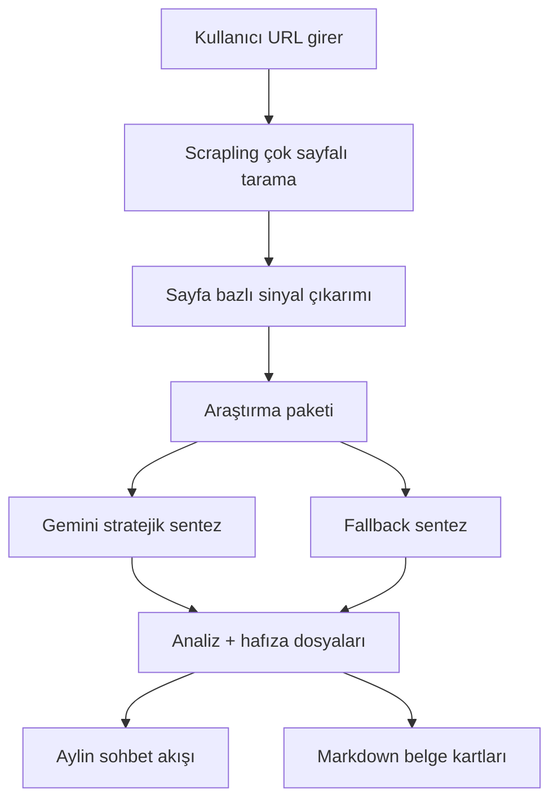

# Acrtech AI Marketer - İlk Analiz Master Planı

Tarih: 2026-04-03
Durum: Aktif çalışma planı
Sahiplik: İlk kullanıcı deneyimi, ilk analiz kalitesi, agent hissi
Güncelleme Notu: Bu dosya yaşayan plan olarak tutulacaktır. Fazlar ilerledikçe durumlar, kararlar ve kalite kriterleri güncellenecektir.

## 1. Neden Bu Plan Var?

İlk analiz, ürünün "an"ıdır. Kullanıcı burada şu duyguyu yaşamalı:

- Bu agent markamı gerçekten anladı.
- Bu sadece özet çıkarmıyor, iş modelimi çözüyor.
- Bu ekip pazarlamayı ve kategori dinamiklerini biliyor.
- Bu sistemi kullanırsam bana net bir yön verebilir.

Bu yüzden ilk analiz deneyimi üç şeyin birleşimi olmalıdır:

1. Güçlü araştırma paketi
2. Kanıta dayalı stratejik yorum
3. Mesajlaşma içinde profesyonel çalışma dosyaları

## 2. Nihai Hedef

İlk kullanıcı, site URL'sini girdikten sonra Aylin'den şunları almalıdır:

- İşletmenin ne sattığını net anlayan bir ilk bakış
- Güçlü bir konumlandırma içgörüsü
- Marka tonu ve görsel hissi hakkında somut çıkarımlar
- Rakip ve kategori fırsatlarını anlatan pazar okuması
- Uygulanabilir ilk 30 günlük plan
- Sohbet içine düşen, açılıp kapanabilen gerçek `.md` çalışma dosyaları

## 3. Temel İlke

Sistem şu ayrımı net koruyacaktır:

- Scrapling = kanıt toplar
- Araştırma paketi = kanıtı karar verilebilir hale getirir
- Gemini = kanıtı stratejiye çevirir
- Aylin sohbeti = bu stratejiyi güven veren bir çalışma deneyimine dönüştürür

## 4. Fazlar

## Faz 1 - Araştırma Paketi

Durum: `completed`

Amaç:
Ham scrape çıktısını, ilk analizi gerçekten besleyen bir araştırma paketine dönüştürmek.

Teslimatlar:

- taranan sayfaların daha iyi sınıflandırılması
- ana teklif, alt teklifler, ürün/hizmet kümeleri
- hedef kitle sinyalleri
- güven ve sosyal kanıt sinyalleri
- dönüşüm yolları, CTA ve form sinyalleri
- içerik/SEO sinyalleri
- coğrafya, dil, fiyat ve pazar sinyalleri
- Gemini'ye giden sıkıştırılmış araştırma paketi

Başarı ölçütü:

- tek bir analiz çıktısında "bu site ne yapıyor?" sorusu açık kalmayacak
- prompt'a ham text değil, tematik kanıt blokları gidecek
- aynı veri fallback analizini de güçlendirecek

2026-04-03 Uygulama Notu:

- `scrape.py` içinde `research_package` katmanı eklendi
- şirket adı adayları, hero mesajları, positioning sinyalleri, offer sinyalleri, audience/trust/proof sinyalleri ayrıştırıldı
- SEO, coğrafya, dil, görsel ve pazar sinyalleri ayrı bloklar halinde üretildi
- crawl limiti ilk analiz için 12 sayfaya çıkarıldı
- `gemini.py` prompt'u araştırma paketi merkezli yeniden yazıldı
- `fallback.py` aynı araştırma paketini kullanacak şekilde yenilendi
- `researchPackage` response modeli backend ve frontend tiplerine eklendi

## Faz 2 - Stratejik Yorum Katmanı

Durum: `completed`

Amaç:
Gemini'nin genel pazarlama cümleleri kurması yerine, bu markaya özgü stratejik yorum üretmesi.

Teslimatlar:

- konumlandırma yorumu
- farklılaştırıcı unsur
- muhtemel hedef segmentler
- teklif boşlukları
- pazar fırsatı
- riskler
- ilk büyüme kaldıraçları

Başarı ölçütü:

- her analizde en az bir güçlü positioning insight olacak
- her analizde en az bir net growth lever olacak
- cümleler genel değil, site kanıtına bağlı olacak

2026-04-03 Uygulama Notu:

- `analysis_enrichment.py` eklendi
- `strategicSummary` katmanı response içine taşındı
- positioning, differentiation, best-fit audience, primary growth lever, conversion gap ve content angle alanları üretildi
- workspace sağ panelinde stratejik bakış kartı eklendi

## Faz 3 - Hafıza Dosyası Şablonları

Durum: `completed`

Amaç:
`.md` dosyalarını tutarlı, dolu ve gerçek çalışma belgesi gibi hissettirmek.

Zorunlu dosyalar:

- `business-profile.md`
- `brand-guidelines.md`
- `market-research.md`
- `strategy.md`

Teslimatlar:

- her dosya için sabit section yapısı
- tablo, madde, alt başlık, aksiyon dili
- farklı site tiplerine göre küçük varyasyonlar

Başarı ölçütü:

- kullanıcı bir dosyayı açtığında "bu benim markam için hazırlanmış" demeli
- belge içinde boş tekrar ve genel geçer doldurma olmamalı

2026-04-03 Uygulama Notu:

- `memory_templates.py` eklendi
- 4 ana hafıza dosyası için zorunlu şablon ve heading yapısı tanımlandı
- Gemini çıktısı kısa veya eksik kalırsa şablon tabanlı default belgeye düşülüyor
- dosya adları standardize edildi: `business-profile.md`, `brand-guidelines.md`, `market-research.md`, `strategy.md`

## Faz 4 - Agent Deneyimi ve Dramaturji

Durum: `completed`

Amaç:
Aylin'in konuşmalarını gerçek bir agent ilerleyişi gibi hissettirmek.

Teslimatlar:

- açılış mesajı
- canlı süreç adımları
- ilk bulgu mesajı
- ilk dosya düşüşü
- derinleşme mesajı
- ikinci dosya düşüşü
- final insight

Başarı ölçütü:

- her mesaj yeni bilgi taşımalı
- yükleme hissi değil, "arka planda çalışan uzman" hissi oluşmalı
- sohbet tek blok değil, ritimli bir akış gibi ilerlemeli

2026-04-03 Uygulama Notu:

- `chat_store.py` yeniden yazıldı
- ilk analiz thread’i 7 mesajlık akışa çevrildi
- ilk dosya düşüşü ve ikinci dosya düşüşü ayrı ayrı gösteriliyor
- final mesajında büyüme fırsatı ve analiz kapsam puanı birlikte veriliyor

## Faz 5 - Kalite Kontrol ve Değerlendirme Rubriği

Durum: `completed`

Amaç:
İlk analiz kalitesini ölçülebilir hale getirmek.

Teslimatlar:

- zorunlu kontrol listesi
- site tipi bazlı kalite kriterleri
- ACRTECH referans testi
- "yayına hazır değil" eşikleri

Başarı ölçütü:

- kötü veya yüzeysel analiz kolayca tespit edilebilecek
- yeni prompt veya extractor değişiklikleri objektif olarak değerlendirilebilecek

2026-04-03 Uygulama Notu:

- `qualityReview` katmanı response modeline eklendi
- skor, verdict, strengths, risks ve check listesi üretiliyor
- frontend’de analiz sağlığı kartı eklendi
- ACRTECH üzerinde fallback + enrichment testiyle kalite rubriği çalıştırıldı

## 5. Fazlar Arası Veri Akışı

## 6. İlk Analiz Sohbet Akışı Şablonu

### Mesaj 1 - Açılış

Amaç:
Kullanıcıya Aylin'in gerçekten çalışmaya başladığını hissettirmek.

Örnek ton:

"Web sitene dalıyorum ve pazarlama temelini kurmaya başlıyorum. İçerikleri, teklif yapını ve kategori sinyallerini tek yerde topluyorum."

### Mesaj 2 - Canlı Süreç

Gösterilecek adımlar:

- İçeriğini çekiyorum
- Önemli sayfaları ve teklif yapını tarıyorum
- Pazar ve fırsat sinyallerini yorumluyorum
- Çalışma dosyalarını kaydediyorum

### Mesaj 3 - İlk Bakış

Bu mesajda mutlaka olmalı:

- şirket ne yapıyor
- dikkat çeken konumlandırma içgörüsü
- marka hissi veya teklif yapısı hakkında bir yorum

### Mesaj 4 - İlk Dosya Düşüşü

Bu aşamada açılacak belgeler:

- `business-profile.md`
- `brand-guidelines.md`

### Mesaj 5 - Derinleşme

Bu mesajda mutlaka olmalı:

- pazar ısısı
- kategori fırsatı
- rakip sıkışıklığı veya boşluğu
- içerik / SEO fırsatı

### Mesaj 6 - İkinci Dosya Düşüşü

Bu aşamada açılacak belgeler:

- `market-research.md`
- `strategy.md`

### Mesaj 7 - Final Insight

Bu cümle tek ve güçlü olmalı.

Beklenen etki:

- kullanıcı "bunu düşünmemiştim" demeli
- insight somut büyüme kaldırağı taşımalı

## 7. Belge Şablonları

## `business-profile.md`

Zorunlu bölümler:

- Company Overview
- Offer Architecture
- Services / Products
- Tech Stack
- Target Audience
- Positioning
- USP
- Contact Signals
- Strategic Notes

## `brand-guidelines.md`

Zorunlu bölümler:

- Visual Identity
- Logo
- Color / Theme Signals
- Typography Signals
- Tone of Voice
- Messaging Pillars
- CTA Language
- Trust Language

## `market-research.md`

Zorunlu bölümler:

- Market Context
- Competitive Frame
- Keyword / Topic Opportunities
- Audience Segments
- Risks
- Opportunity Map

## `strategy.md`

Zorunlu bölümler:

- North Star Goal
- SEO
- Content
- Social
- Email
- Paid Ads
- Quick Wins
- Metrics to Watch

## 8. Faz 1 İçin Araştırma Paketi Şeması

Faz 1 sonunda backend şu tematik araştırma alanlarını üretmelidir:

- `companyNameCandidates`
- `heroMessages`
- `positioningSignals`
- `offerSignals`
- `serviceOffers`
- `productOffers`
- `audienceSignals`
- `trustSignals`
- `proofPoints`
- `conversionActions`
- `contentTopics`
- `seoSignals`
- `geographySignals`
- `languageSignals`
- `marketSignals`
- `visualSignals`

Bu alanlar doğrudan UI'da gösterilmek zorunda değildir. Öncelikli amaç, Gemini ve fallback için daha güçlü girdi üretmektir.

## 9. Kalite Rubriği

Her ilk analiz aşağıdaki sorulara "evet" dedirtmelidir:

- Marka ne yapıyor, ilk paragrafta net mi?
- Hedef kitle soyut değil, belirgin mi?
- Teklif yapısı doğru okunmuş mu?
- Farklılaştırıcı unsur bulunmuş mu?
- Güven eksikleri görünür mü?
- En az bir güçlü SEO / içerik fırsatı var mı?
- En az bir dönüşüm optimizasyon içgörüsü var mı?
- Final insight gerçekten özgül mü?

## 10. ACRTECH Referans Testi

İlk kalite testi ACRTECH üzerinde yapılacaktır.

Beklenen örnek içgörüler:

- agency + product company dual positioning
- Teknopark ve yerel güven sinyalleri
- ürün bazlı ayrı growth motion ihtiyacı
- İngilizce / Türkçe pazar sinyali ayrımı
- OlricGEO gibi ürünler için kategori fırsatı

Bu maddeler birebir kopyalanmak zorunda değildir; ancak analiz benzer derinlikte olmalıdır.

## 11. Şimdi Ne Yapıyoruz?

Bu çalışma turunda hedef:

1. Bu planı repo içinde sabitlemek
2. Faz 1 araştırma paketi veri modelini kurmak
3. Scrapling çıktılarını araştırma bloklarına ayırmak
4. Gemini promptunu bu bloklarla yeniden beslemek
5. Fallback analizini aynı araştırma paketiyle güçlendirmek

## 12. Sonraki Güncelleme Kuralı

Bu dosyada her faz için şu bilgiler güncellenecek:

- durum
- yapılan teknik değişiklikler
- açık kalan riskler
- kalite notları
- ACRTECH test sonucu
